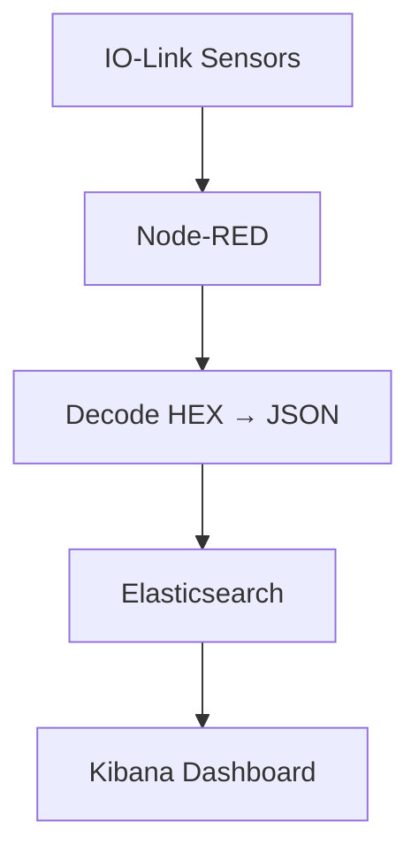

# 🧠 Sensor Platform – Real-Time Industrial IoT Monitoring

This project integrates **Node-RED**, **Elasticsearch**, and **Kibana** into a unified industrial IoT data platform.
It collects real-time data from **IO-Link vibration** and **ultrasonic sensors**, decodes them, and visualizes the results using **Kibana dashboards** — all containerized with **Docker** and **Kubernetes**.

---

## 🚀 Features

* 🌐 **Node-RED**: Low-code IoT flow automation
* ⚙️ **Custom decoder** for IO-Link hex sensor data
* 📦 **Elasticsearch**: Time-series data storage and indexing
* 📊 **Kibana**: Analytics and dashboards
* ☸️ **Kubernetes-ready**: Runs on Docker Desktop or Cloud
* 🔄 **End-to-end**: Sensor → Node-RED → Elasticsearch → Kibana

---

## 🧩 Architecture Overview



---

## 🐳 Docker Deployment

### 1️⃣ Build and Push Image

if u want to pull the repositry from docker use this cmd - docker pull archit05931/sensor-platform
```bash
docker build -t archit05931/sensor-platform:latest .
docker push archit05931/sensor-platform:latest
```

### 2️⃣ Start the full stack

```bash
docker-compose up -d
```

### 3️⃣ Access Services

| Service       | URL                                            | Port |
| ------------- | ---------------------------------------------- | ---- |
| Node-RED      | [http://localhost:1880](http://localhost:1880) | 1880 |
| Elasticsearch | [http://localhost:9200](http://localhost:9200) | 9200 |
| Kibana        | [http://localhost:5601](http://localhost:5601) | 5601 |

---

## ☸️ Kubernetes Deployment

### 1️⃣ Apply all services at once

Use the combined manifest file:

```bash
kubectl apply -f .\sensor-platform-stack.yml
```

*(Windows PowerShell – use `./sensor-platform-stack.yml` on Linux/Mac)*

### 2️⃣ Verify the deployment

```bash
kubectl get pods -o wide
kubectl get svc
```

### 3️⃣ Port-forward all services for local access

```bash
kubectl port-forward service/nodered-service 30080:1880
kubectl port-forward service/elasticsearch-service 30082:9200
kubectl port-forward service/kibana-service 30081:5601
```

### 4️⃣ Open in Browser

| Service       | URL                                              |
| ------------- | ------------------------------------------------ |
| Node-RED      | [http://localhost:30080](http://localhost:30080) |
| Elasticsearch | [http://localhost:30082](http://localhost:30082) |
| Kibana        | [http://localhost:30081](http://localhost:30081) |

---

## 🔧 Test Elasticsearch Connection

After Elasticsearch is up, verify with a test request:

### 🪟 PowerShell

```powershell
Invoke-RestMethod -Uri "http://localhost:9200/sensor-data/_doc" -Method POST -Body '{"test":"ok"}' -ContentType "application/json"
```

### 🐧 Linux/macOS

```bash
curl -X POST "http://localhost:9200/sensor-data/_doc" \
-H "Content-Type: application/json" \
-d '{"test":"ok"}'
```

✅ You should receive a response with `_id` confirming successful indexing.

---

## ⚙️ Node-RED Flow Summary

* Collects sensor data from **IO-Link Master** (`192.168.1.10`)
* Decodes both:

  * 🌀 **Vibration Sensor (VVB001)**
  * 🌊 **Ultrasonic Sensor (U2000)**
* Sends JSON data to **Elasticsearch index: `sensor-data`**

> Elasticsearch endpoint used in Node-RED:
>
> ```
> http://localhost:9200/sensor-data/_doc
> ```

---

## 📊 Kibana Visualization

1. Open Kibana → [http://localhost:30081](http://localhost:30081)
2. Navigate to **Stack Management → Index Patterns**
3. Create a new pattern:

   ```
   sensor-data*
   ```
4. Go to **Discover** to see live sensor entries
5. Build charts for temperature, vibration, or distance metrics

---

## ☁️ Cloud and Scaling

* Compatible with **Docker Hub Cloud**, **AWS EKS**, **Azure AKS**, or **Google GKE**
* Supports horizontal scaling for **Node-RED** and **Elasticsearch**
* Future-ready for **live data ingestion**, **alerting**, and **dashboard sharing**

---

## 🧑‍💻 Author

**Archit Sharma**
IoT Developer | Cloud & Edge Integrator
🔗 [GitHub Repo](https://github.com/ArchitShar1999/sensor-platform)
🔗 [Docker Hub Image](https://hub.docker.com/r/archit05931/sensor-platform)

